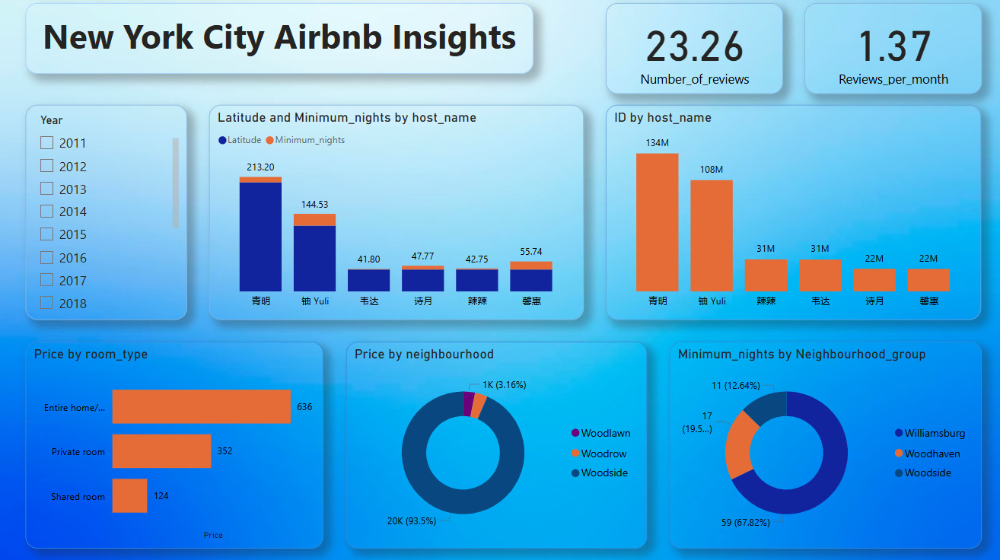

# 🏙️ New York City Airbnb Data Analysis Dashboard (Power BI)

## 📌 Project Overview

This Power BI dashboard analyzes Airbnb listings in New York City to understand pricing patterns, host activity, and neighborhood distribution.

The dashboard highlights insights about room types, listing counts, review patterns, and minimum stay requirements.

## 🎯 Objectives

* Analyze Airbnb listing prices by room type
* Understand distribution of listings across neighborhoods
* Study host activity and listing counts
* Explore review patterns and engagement

## 📊 Key Metrics

* Average Number of Reviews: 23.26
* Reviews per Month: 1.37
* Listings analyzed across multiple NYC neighborhoods

## 📈 Key Insights

* Entire homes have significantly higher prices compared to private and shared rooms.
* Some hosts manage a large number of listings.
* Listings are concentrated in a few key neighborhoods.
* Minimum stay requirements vary across neighborhood groups.

## 📊 Visualizations Used

* KPI Cards
* Bar Charts
* Donut Charts
* Year Filter
* Neighborhood Analysis

## 🛠 Tools Used

* Power BI
* Data Visualization
* Data Analysis

## 📷 Dashboard Preview

